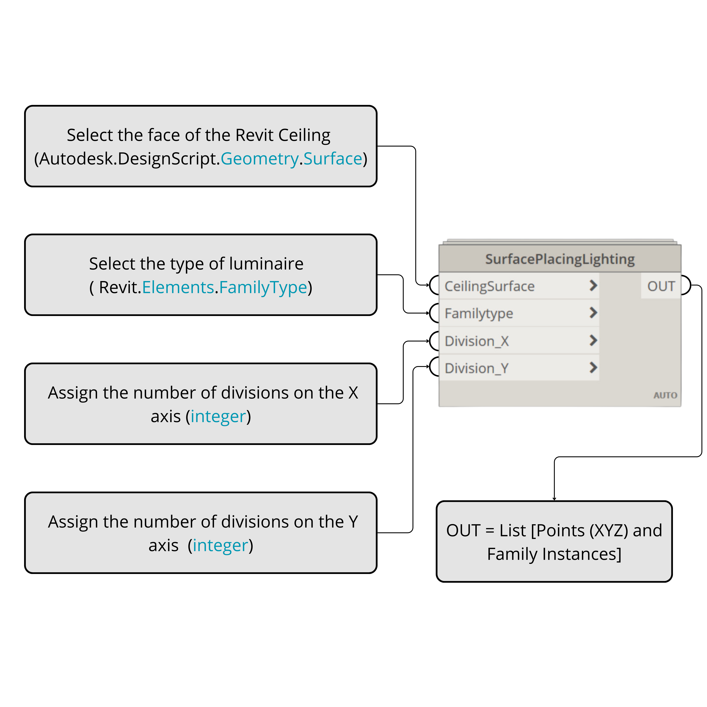
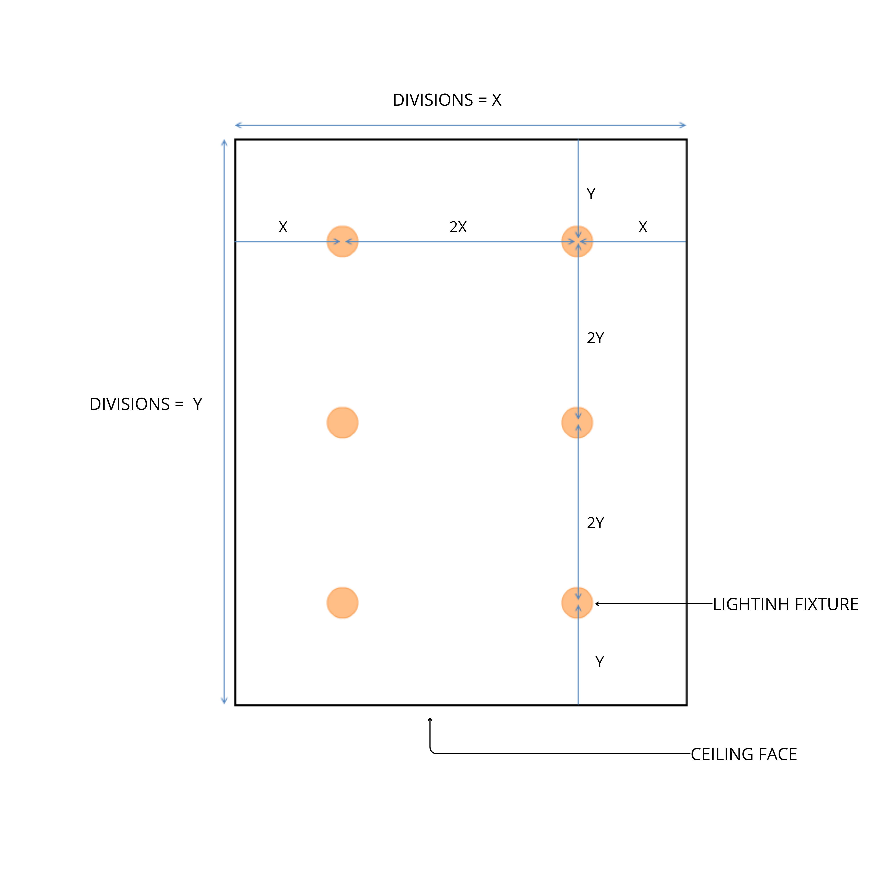
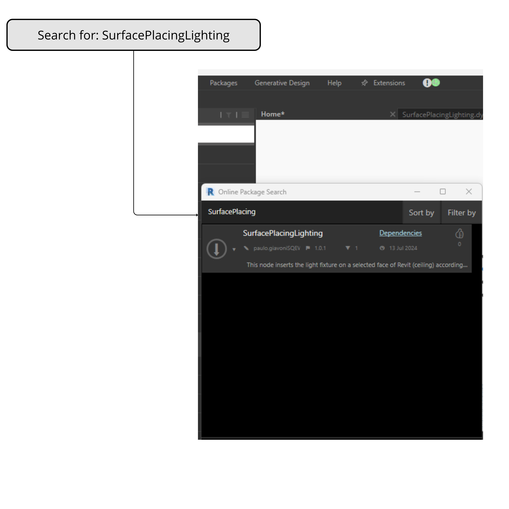

# SurfacePlacingLighting Node

O node SurfacePlacingLighting é projetado para inserir luminárias em uma face selecionada de um teto no Revit, de acordo com os critérios gerais de espaçamento de iluminação. Os critérios de espaçamento garantem uma distribuição uniforme das luminárias, mantendo uma distância especificada \(L\) entre a luminária e a parede, e \(2L\) entre as luminárias. O usuário deve selecionar as divisões necessárias em cada eixo para alcançar a configuração desejada.

## Como Usar

1. **Entendendo o Node Personalizado e Seus Inputs**:
   
     
   Esta imagem mostra o node personalizado e seus inputs, explicando as entradas necessárias:
   - **CeilingSurface**: A face do teto no Revit.
   - **FamilyType**: O tipo de luminária.
   - **Division_X**: O número de divisões no eixo X.
   - **Division_Y**: O número de divisões no eixo Y.

2. **Critérios de Posicionamento das Luminárias**:
   
     
   O script respeita os critérios de posicionamento das luminárias, garantindo que o espaçamento entre a luminária e a parede seja \(L\) e o espaçamento entre as luminárias seja \(2L\), mantendo uma distribuição uniforme:
   - **X**: Distância da parede até a primeira luminária.
   - **2X**: Distância entre as luminárias subsequentes ao longo do eixo X.
   - **Y**: Distância da parede até a primeira luminária ao longo do eixo Y.
   - **2Y**: Distância entre as luminárias subsequentes ao longo do eixo Y.

3. **Carregando e Pesquisando um Pacote no Dynamo**:
   
     
   Esta imagem orienta sobre como carregar e pesquisar um pacote no Dynamo. Pesquise por SurfacePlacingLighting para encontrar e instalar o node personalizado.

---

Happy Designing! 🎨
