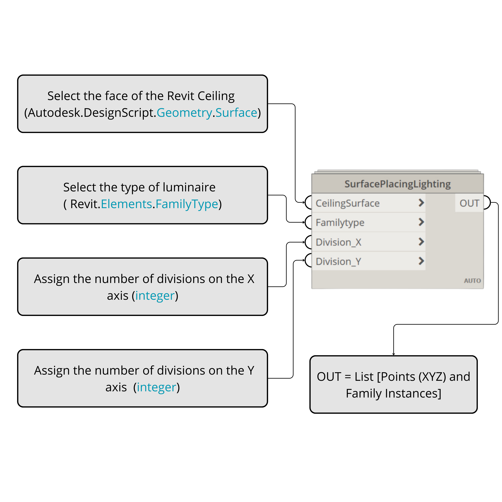
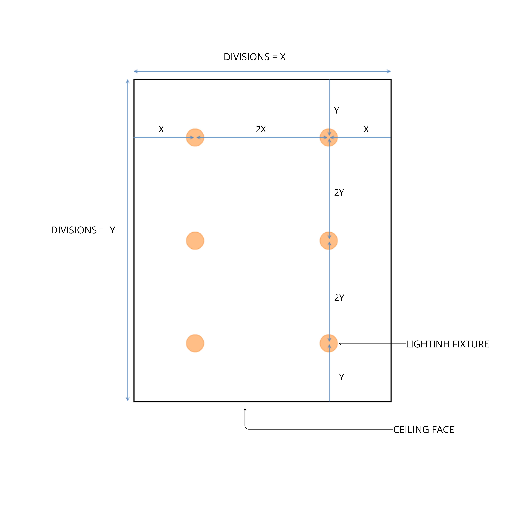
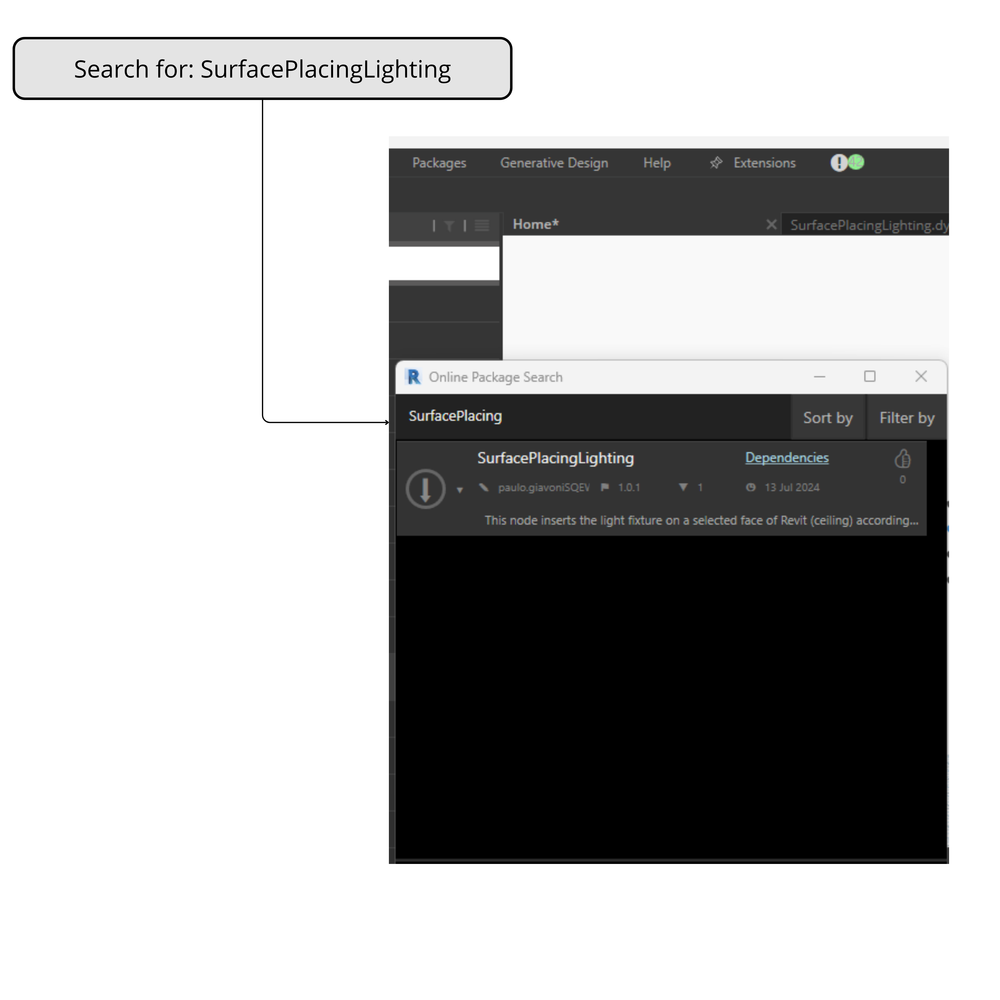

# Electrical Tool Box

Welcome to the Electrical Tool Box repository! This repository is dedicated to providing a comprehensive set of Dynamo solutions aimed at enhancing the efficiency and accuracy of electrical design in Revit. Whether you're a beginner or an experienced professional, you'll find valuable resources to streamline your workflow.

## Features

- **Dynamo Scripts**: Ready-to-use scripts for tasks such as cable routing, conductor sizing, and automatic single-line diagram creation.
- **Detailed Documentation**: Step-by-step guides and tutorials to help you implement and customize each solution.
- **Educational Resources**: Access to tutorial videos and other learning materials to expand your knowledge.
- **Community Support**: Engage with other users, share ideas, and get help with your projects.

## Getting Started

### Prerequisites
- Revit (version 2022.1 or higher)
- Dynamo (version 2.12 or higher)

---

## SurfacePlacingLighting Node

The `SurfacePlacingLighting` node is designed to insert light fixtures on a selected face of a Revit ceiling according to general lighting spacing criteria. The spacing criteria ensure an even distribution of light fixtures, maintaining a specified distance \(L\) between the fixture and the wall, and \(2L\) between fixtures. The user must select the necessary divisions on each axis to achieve the desired configuration.

### How to Use

1. **Understanding the Custom Node and Its Inputs**:
   
   This image shows the custom node and its inputs, explaining the required entries:
   - **CeilingSurface**: The face of the Revit ceiling.
   - **FamilyType**: The type of luminaire.
   - **Division_X**: The number of divisions on the X axis.
   - **Division_Y**: The number of divisions on the Y axis.

2. **Lighting Placement Criteria**:
   
   The script respects the lighting placement criteria, ensuring that the spacing between the fixture and the wall is \(L\) and the spacing between fixtures is \(2L\), maintaining an even distribution:
   - **X**: Distance from the wall to the first fixture.
   - **2X**: Distance between subsequent fixtures along the X axis.
   - **Y**: Distance from the wall to the first fixture along the Y axis.
   - **2Y**: Distance between subsequent fixtures along the Y axis.

3. **Loading and Searching for a Package in Dynamo**:
   
   This image guides you on how to load and search for a package in Dynamo. Search for `SurfacePlacingLighting` to find and install the custom node.

---

Happy Designing! 🚀
